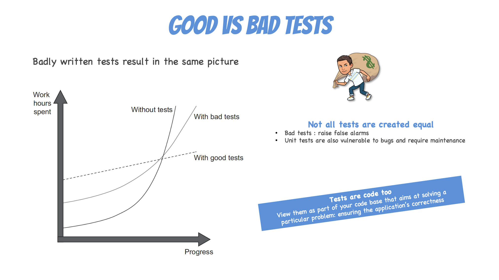

# Unit Testing Intro
Introduction to Unit Tests in scala, java, php, angular and c#

## Connection - Three Facts and a Question (10')
- In pairs, take 2 minutes to come up with three facts about `Unit Testing` and 1 question you have about it
  - Collate all the facts from all the pairs into one list 
- Come back to the facts and questions in the `conclusions` part if not before

## Concepts - Unit Testing (10')




## Concrete Practice - Test it or Die Trying (35')

- ADD EXPLANATIONS IN DIFFERENT LANGUAGES

```scala
object TimeUtility {
  def timeOfDay: String = {
    LocalTime.now() match {
      case night if night.getHour >= 0 && night.getHour < 6 => "Night"
      case morning if morning.getHour >= 6 && morning.getHour < 12 => "Morning"
      case afternoon if afternoon.getHour >= 12 && afternoon.getHour < 18 => "Afternoon"
      case _ => "Evening"
    }
  }
}
```

- Write at least one test for it
  - Which problem will you encounter?

```scala
class TimeUtilityTests
  extends AnyFlatSpec
    with Matchers {

  "time description" should "be Afternoon" in {
    TimeUtility.timeOfDay should be("Afternoon")
  }
}
```

- This test is not repeatable because the design is coupled to `LocalTime.now()`
  - We need to isolate it to be able to test this unitary
  - A few solutions here :
    - Pass a `LocalTime` as method arg
    - Pass a `Clock` which will provide a `time()`method that we will be able to substitute
    - Pas a function `clock: Unit => LocalTime`

## Conclusion - Back to the questions (10')
Come back to the facts and questions:
- Are you able to your questions now? 
- Review your facts and update any you have learnt more about now